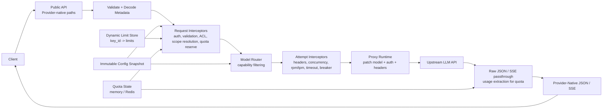

# llmgw

Proxy-first LLM gateway in Go for routing, limits, and quota enforcement.

## API

- `GET /v1/models`
- `GET /v1/limits`
- `PUT /v1/limits`
- `POST /v1/chat/completions`
- `POST /v1/responses`
- `POST /v1/completions`
- `POST /v1/embeddings`
- `POST /v1/messages`
- `POST /v1beta/models/{model}:generateContent`
- `POST /v1beta/models/{model}:streamGenerateContent`
- `POST /v1beta/models/{model}:embedContent`
- `POST /v1/models/{model}:generateContent`
- `POST /v1/models/{model}:streamGenerateContent`
- `POST /v1/models/{model}:embedContent`
- `GET /openapi.json`
- `GET /openapi.yaml`
- `GET /docs`
- `GET /healthz`
- `GET /readyz`
- `GET /metrics`
- Provider-native request validation with raw upstream proxying
- Bounded SSE streaming with provider-native terminal-event validation; text-only legacy completions can stream through the loss-checked chat bridge, while Responses streaming requires a Responses-native route
- Model-based routing, capability filtering, fallback, circuit breaking, rpm/tpm/concurrency, quota reservation, rate limiting via `x/time/rate` and `redis_rate`, metrics, and tracer hook points

Ingress is provider-native: existing OpenAI, Anthropic, and Gemini clients can keep their request contracts and only change the base URL.

Gateway tokens use the native client credential header on provider-native paths: `x-api-key` for Anthropic and `x-goog-api-key` for Gemini. OpenAI paths, model discovery, and quota management use `Authorization: Bearer`. The gateway credential is consumed at ingress and is never forwarded upstream; upstream credentials come from route config.

## Run

Local source builds require Go 1.24 or newer. CI tests the latest 1.24 patch release as the compatibility floor and Go 1.26.5 as the current toolchain.

Set provider keys:

```bash
export OPENAI_API_KEY=...
export ANTHROPIC_API_KEY=...
export GEMINI_API_KEY=...
export LLMGW_BEARER_TOKEN="$(openssl rand -hex 32)"
```

Gateway auth can use environment-backed static bearer tokens through `auth.token_envs`, inline development tokens through `auth.tokens`, or JWTs. The example config requires `LLMGW_BEARER_TOKEN`; startup fails when it is missing or empty. Anonymous access must be opted into with `auth.allow_anonymous: true`. For JWT mode, configure `auth.jwt` with an HMAC secret or public key, include an `exp` claim, and map the `key_id` claim to the quota subject. HMAC secrets must be at least 32, 48, or 64 bytes for HS256, HS384, or HS512 respectively; RSA public keys must be at least 2048 bits. Quota enforcement is key-scoped. Any authenticated principal can read its `/v1/limits`; writing limits additionally requires the `manage_limits` permission. The checked-in inference token intentionally lacks that permission, so quota administration requires a separate static or JWT principal. Metrics, generated specifications, and Swagger UI require the `view_operations` permission whenever anonymous access is disabled.

Start the gateway:

```bash
go run ./cmd/llmgw -config config/config.example.yaml
```

Run with Docker Compose:

```bash
export OPENAI_API_KEY=...
export ANTHROPIC_API_KEY=...
export GEMINI_API_KEY=...
export LLMGW_BEARER_TOKEN="$(openssl rand -hex 32)"
docker compose up --build
```

Build and run the container directly:

```bash
cp config/config.example.yaml config/config.yaml
docker build -t llmgw:local .
docker run --rm -p 8080:8080 \
  -e LLMGW_BEARER_TOKEN \
  -e OPENAI_API_KEY \
  -e ANTHROPIC_API_KEY \
  -e GEMINI_API_KEY \
  -v "$PWD/config/config.yaml:/etc/llmgw/config.yaml:ro" \
  llmgw:local
```

## Publish a Nebius candidate (GitHub Actions)

This repo includes [`.github/workflows/deploy-nebius.yml`](.github/workflows/deploy-nebius.yml).

The workflow is restricted to the repository's default branch and targets the `nebius-production` GitHub Environment. Before the first run, create that environment, restrict its deployment branches to the default branch, and configure required reviewers. Store deployment credentials as environment secrets rather than repository-wide secrets.

Required `nebius-production` environment secrets:

- `NB_PROJECT_ID`
- `NB_SUBNET_ID`
- `NB_SERVICE_ACCOUNT_ID`
- `NB_PUBLIC_KEY_ID`
- `NB_PRIVATE_KEY_PEM`
- `LLMGW_BEARER_TOKEN`

For production, set the `NB_RUNTIME_SECRET_SELECTOR` environment variable to a Nebius MysteryBox secret name, ID, version ID, or `SECRET_ID@VERSION_ID`. That secret must contain `AUTH_TOKEN`, `LLMGW_BEARER_TOKEN`, `OPENAI_API_KEY`, `ANTHROPIC_API_KEY`, and `GEMINI_API_KEY` payloads, and the endpoint service account must be allowed to read it. The two token payloads and the GitHub `LLMGW_BEARER_TOKEN` secret must have the same value: Nebius consumes `AUTH_TOKEN`, the container reads `LLMGW_BEARER_TOKEN`, and the workflow uses its copy for readiness checks.

For a private registry, set `NB_REGISTRY_SECRET_SELECTOR` to a MysteryBox secret containing `REGISTRY_USERNAME` and `REGISTRY_PASSWORD`. Omit it when the GHCR package is publicly readable.

The manually triggered workflow exposes an `allow_plaintext_secrets` override for non-production candidates. Enabling it requires these additional environment secrets:

- `OPENAI_API_KEY`
- `ANTHROPIC_API_KEY`
- `GEMINI_API_KEY`
- `NB_REGISTRY_USERNAME` and `NB_REGISTRY_PASSWORD` together when the package is private

Without that explicit override, the workflow refuses to put raw runtime or registry secrets in endpoint configuration. Do not use the plaintext mode for production; principals that can inspect the endpoint can read those values.

Optional `nebius-production` environment variables:

- `NB_ENDPOINT_NAME` (default: `llmgw`)
- `NB_PLATFORM` (default: `cpu-d3`)
- `NB_PRESET` (default: `4vcpu-16gb`)
- `NB_CONTAINER_PORT` (default: `8080`)

The manually triggered workflow validates the repository, builds and pushes a Docker image to GHCR, and creates a uniquely named immutable Nebius candidate. It waits for the candidate's `/readyz` check and deletes that new candidate if readiness fails, so same-commit reruns can safely correct configuration without leaking an endpoint. Nebius does not offer in-place endpoint updates, so this workflow deliberately stops at a verified candidate and never claims a production deployment. Switch an external router or DNS record to the reported address, verify production traffic, and only then retire an older revision. The same `LLMGW_BEARER_TOKEN` protects both the Nebius endpoint and the gateway, allowing one `Authorization` header to pass both layers.

Generate the OpenAPI YAML without starting the server:

```bash
tmp="$(mktemp ./.openapi.yaml.XXXXXX)"
trap 'rm -f "$tmp"' EXIT
LLMGW_BEARER_TOKEN=openapi-placeholder \
OPENAI_API_KEY=openapi-placeholder \
ANTHROPIC_API_KEY=openapi-placeholder \
GEMINI_API_KEY=openapi-placeholder \
  go run ./cmd/llmgw -config config/config.example.yaml -print-openapi > "$tmp"
mv "$tmp" openapi.yaml
trap - EXIT
```

The checked-in [`openapi.yaml`](openapi.yaml) is a convenience snapshot. The live source of truth is generated from the running config and served at `/openapi.yaml`.

Reload config in place:

```bash
pkill -HUP -f llmgw
```

Reload atomically updates routes, authentication, quota profiles, and request-path policy. Listener/server timeouts, store connections, and telemetry are restart-only; a reload that changes those sections is rejected and the previous snapshot remains active.

## Performance benchmark

Run the loopback HTTP benchmark for the main endpoints:

```bash
go test ./test/performance \
  -run '^$' \
  -bench '^BenchmarkHTTP$' \
  -benchmem \
  -benchtime=5s \
  -count=3
```

The benchmark exercises the real HTTP ingress and the production-style in-memory auth, required user/project checks, token validation, key-scoped quota reservation, RPM/TPM, route/provider concurrency, ACL, routing, metrics, response, and settlement path. Limit ceilings are deliberately high enough to execute enforcement without throttling valid benchmark traffic. An in-process provider stub returns a fixed successful response immediately, so the result measures gateway throughput without external provider or network latency. The load generator and gateway share the same Go process and CPU allocation; use `-cpu=1,4,8` to compare scaling. JSON logs are formatted but written to `io.Discard`, keeping terminal or disk speed out of the measurement.

## Curl

List models:

```bash
curl -s http://localhost:8080/v1/models \
  -H "Authorization: Bearer $LLMGW_BEARER_TOKEN"
```

OpenAI chat completions:

```bash
curl -s http://localhost:8080/v1/chat/completions \
  -H "Authorization: Bearer $LLMGW_BEARER_TOKEN" \
  -H 'Content-Type: application/json' \
  -d '{
    "model":"gpt-4o-mini",
    "messages":[{"role":"user","content":"Say hello in one sentence."}]
  }'
```

OpenAI chat streaming:

```bash
curl -N http://localhost:8080/v1/chat/completions \
  -H "Authorization: Bearer $LLMGW_BEARER_TOKEN" \
  -H 'Content-Type: application/json' \
  -d '{
    "model":"gpt-4o-mini",
    "stream":true,
    "messages":[{"role":"user","content":"Count to 3."}]
  }'
```

OpenAI responses:

```bash
curl -s http://localhost:8080/v1/responses \
  -H "Authorization: Bearer $LLMGW_BEARER_TOKEN" \
  -H 'Content-Type: application/json' \
  -d '{
    "model":"gpt-4o-mini",
    "input":"Summarize the purpose of this gateway in one line."
  }'
```

OpenAI legacy completions:

```bash
curl -s http://localhost:8080/v1/completions \
  -H "Authorization: Bearer $LLMGW_BEARER_TOKEN" \
  -H 'Content-Type: application/json' \
  -d '{
    "model":"gpt-4o-mini",
    "prompt":"Write one short sentence about Go."
  }'
```

Text-only legacy completions can also stream through the loss-checked chat bridge. Fields that cannot be represented without loss are rejected before dispatch; unlike completions, Responses streaming requires a Responses-native route:

```bash
curl -N http://localhost:8080/v1/completions \
  -H "Authorization: Bearer $LLMGW_BEARER_TOKEN" \
  -H 'Content-Type: application/json' \
  -d '{
    "model":"gpt-4o-mini",
    "prompt":"Count to three:",
    "stream":true
  }'
```

OpenAI embeddings:

```bash
curl -s http://localhost:8080/v1/embeddings \
  -H "Authorization: Bearer $LLMGW_BEARER_TOKEN" \
  -H 'Content-Type: application/json' \
  -d '{
    "model":"text-embedding-3-small",
    "input":"gateway"
  }'
```

JWT-backed quota limits:

```bash
export LLMGW_JWT_SECRET=test-secret-that-is-at-least-32-bytes

TOKEN="$(python3 - <<'PY'
import base64, hashlib, hmac, json, os, time

def b64url(value):
    return base64.urlsafe_b64encode(value).rstrip(b'=')

header = b64url(json.dumps({
  'alg': 'HS256',
  'typ': 'JWT',
}, separators=(',', ':')).encode())
payload = b64url(json.dumps({
  'iss': 'llmgw',
  'aud': 'gateway',
  'sub': 'session-1',
  'key_id': 'partner-key-123',
  'permissions': ['manage_limits'],
  'iat': int(time.time()),
  'exp': int(time.time()) + 3600,
}, separators=(',', ':')).encode())
signing_input = header + b'.' + payload
signature = b64url(hmac.new(
    os.environ['LLMGW_JWT_SECRET'].encode(),
    signing_input,
    hashlib.sha256,
).digest())
print((signing_input + b'.' + signature).decode())
PY
)"

curl -s http://localhost:8080/v1/limits \
  -H "Authorization: Bearer $TOKEN"

curl -s -X PUT http://localhost:8080/v1/limits \
  -H "Authorization: Bearer $TOKEN" \
  -H 'Content-Type: application/json' \
  -d '{
    "rpm": 120,
    "tpm": 500000,
    "max_parallel": 8,
    "daily_tokens": 2000000
  }'
```

This example requires uncommenting the `auth.jwt` block in `config/config.example.yaml` (or adding an equivalent block to your own config) and restarting/reloading the gateway; exporting a secret alone does not enable JWT authentication.

Metrics:

```bash
curl -s http://localhost:8080/metrics \
  -H "Authorization: Bearer $LLMGW_BEARER_TOKEN"
```

OpenAPI YAML:

```bash
curl -s http://localhost:8080/openapi.yaml \
  -H "Authorization: Bearer $LLMGW_BEARER_TOKEN"
```

OpenAPI JSON:

```bash
curl -s http://localhost:8080/openapi.json \
  -H "Authorization: Bearer $LLMGW_BEARER_TOKEN"
```

Interactive docs:

```bash
open http://localhost:8080/docs
```

With authentication enabled, the browser or an authenticated reverse proxy must attach `Authorization: Bearer ...` when loading Swagger UI. For local-only interactive use, an explicitly anonymous development config can leave these endpoints public.

Provider-native Anthropic request:

```bash
curl -s http://localhost:8080/v1/messages \
  -H "Authorization: Bearer $LLMGW_BEARER_TOKEN" \
  -H 'Content-Type: application/json' \
  -d '{
    "model":"claude-sonnet-4-6",
    "max_tokens":1024,
    "messages":[{"role":"user","content":"Say hello in one sentence."}]
  }'
```

Provider-native Gemini request:

```bash
curl -s http://localhost:8080/v1beta/models/gemini-2.5-flash:generateContent \
  -H "Authorization: Bearer $LLMGW_BEARER_TOKEN" \
  -H 'Content-Type: application/json' \
  -d '{
    "contents":[{"role":"user","parts":[{"text":"Say hello in one sentence."}]}]
  }'
```

Provider-native Gemini embedding request:

```bash
curl -s http://localhost:8080/v1beta/models/gemini-embedding-2:embedContent \
  -H "Authorization: Bearer $LLMGW_BEARER_TOKEN" \
  -H 'Content-Type: application/json' \
  -d '{"content":{"parts":[{"text":"gateway"}]}}'
```

## Architecture Overview

The gateway uses provider-native ingress paths for each family:
- OpenAI: `/v1/chat/completions`, `/v1/responses`, `/v1/completions`, `/v1/embeddings`
- Anthropic: `/v1/messages`
- Gemini: `/v1beta/models/{model}:generateContent`, `/v1beta/models/{model}:embedContent` (also `/v1/models/{model}:...`)

Requests keep their provider wire format and route only to matching providers. Fallbacks therefore stay within one provider family; this compact version deliberately does not translate an OpenAI request into Anthropic or Gemini wire formats.

The core still uses [`Request`](gateway/types.go) for routing, quota, and policy decisions, but upstream execution is proxy-first: validate the request shape, patch controlled fields like `model`, then forward the raw body to the selected upstream.



The request flow is:

1. HTTP request lands on [`server.go`](api/server.go).
2. Gateway credentials are validated before the request body is read; the body is then validated and decoded into [`Request`](gateway/types.go) metadata plus the original raw body.
3. Request-scope interceptors run once for identity binding, request validation, token estimation, ACL checks, scope resolution, and the request-level quota ticket.
4. The router resolves the requested model name into candidate routes and filters by capabilities.
5. Attempt-scope interceptors run for each upstream attempt, handling provider headers, route/provider concurrency, quota top-up, rpm/tpm, timeout, retry, and circuit breaking.
6. The proxy runtime patches controlled fields like `model`, applies upstream auth, and forwards the raw request body to the selected provider.
7. The gateway passes provider-native output back to the client and extracts usage for quota settlement when it can.
8. Quota is committed or refunded when the call settles.

This keeps the hot path smaller while still supporting routing, fallbacks, streaming, and provider-specific request families.

Provider protocol selection is compile-time and registry-driven. The API server dispatches through `api.Ingress` descriptors, the generic upstream runtime dispatches through `proxy.Adapter` operation maps, and one binding list in `api` pairs the factories used by `api.DefaultIngresses` and `api.DefaultProviders`. `app` consumes those derived defaults. Consequently, a provider does not add another provider-name branch or parallel registration list to the central API server, router, proxy transport, or service wiring.

The HTTP surface also exposes generated OpenAPI documents at [`/openapi.yaml`](api/spec.go) and [`/openapi.json`](api/spec.go), plus Swagger UI at [`/docs`](api/server.go). The spec is generated from code and the current config snapshot, so model enums and auth requirements stay aligned with the running service. In authenticated deployments these metadata endpoints and `/metrics` require a principal with `view_operations`; health and readiness remain public for orchestrator probes.

Config is an immutable snapshot stored behind an atomic pointer. Reload swaps the whole snapshot, so reads stay lock-free on the hot path.

Token validation currently uses effective-request inspection plus local estimation. Unary responses settle quotas from provider usage fields when present; streaming responses use passthrough plus fallback settlement.

Every generative route must declare `capabilities.max_output_tokens`. If a client omits its max-output field, the gateway reserves that route bound instead of assuming a small provider default. Multi-candidate requests are also accounted conservatively: OpenAI `n`, legacy `best_of`, and Gemini `candidateCount` multiply the reserved output tokens with saturating arithmetic before TPM, spend, and quota admission.

Hard spend limits are exact only for routes with complete pricing metadata. Token pricing uses `input_per_1m` and `output_per_1m`; prompt caching can additionally use `cache_read_per_1m` and `cache_write_per_1m`. Provider-metered tools use `provider_units.<name>.micros_per_unit` plus a positive `max_units_per_request` reservation bound. When a hard spend quota is active, hosted tools without both values are rejected before dispatch. Missing route pricing remains non-fatal and records zero spend, so the checked-in sample intentionally uses token quotas rather than claiming a cross-provider hard spend guarantee.

Multimodal estimation uses configurable heuristics because a remote URL does not reveal image dimensions or audio duration. Each distinct image or audio content part adds its route's `vision_input_token_surcharge` or `audio_input_token_surcharge` to the input estimate; enabled routes default to 1024 tokens per image and 8192 tokens per audio part. Set provider/model-specific values and enforce media size or duration upstream when pre-call quota guarantees matter. Provider-reported actual usage is still settled afterward and can top up the reservation, but an underestimated remote asset can exceed a pre-call TPM or spend estimate before settlement.

## How Limits Work

The gateway has more than one kind of limit because different layers solve different problems.

### 1. Token key quotas

These are the limits attached to the authenticated `key_id`. They are enforced once per logical request and represent what a client token is allowed to consume.

Supported key-scoped quota fields:

- `rpm`
- `tpm`
- `max_parallel`
- `max_spend_micros`
- `soft_spend_micros` (observable warning/metric threshold; does not reject traffic)
- `daily_tokens`
- `monthly_tokens`
- `budget_duration` (Go duration string; zero/omitted means a lifetime spend bucket)
- `max_input_tokens`
- `max_output_tokens`
- `model_allowlist`
- `provider_allowlist`

Static defaults can still come from `quota.profiles` and `quota.keys` in config, but runtime overrides now take precedence. `GET /v1/limits` reads the authenticated `key_id`; `PUT /v1/limits` also requires the principal's `manage_limits` permission.

Limit metadata remains available if the live usage lookup is temporarily unavailable: the endpoint returns `200` with `usage_unavailable: true` instead of hiding configured policy behind a transient counter-store failure.

Quota enforcement is reservation-based. A request-level ticket enforces RPM/concurrency, then each real retry or fallback is topped up immediately before dispatch:

1. estimate usage
2. reserve quota
3. call upstream
4. commit actual usage or refund unused reservation

### 2. Route and provider guards

These are operational safeguards, not client entitlement policy. They protect the gateway and upstream providers on each attempt.

Supported route guard fields:

- `rpm`
- `tpm`
- `concurrency`
- `provider_concurrency`
- `max_body_bytes`
- `max_response_bytes` (defaults to 16 MiB, or 64 MiB for embeddings)

In-memory mode uses local `golang.org/x/time/rate` plus in-process concurrency/breaker state. Redis mode adds shared cross-instance controls for route/provider concurrency and circuit-breaker state, and applies quota reservations atomically in Redis. Production deployments should use an environment-backed `rediss://` URL (`store.redis_url_env`) and a deployment-specific `store.redis_namespace`. Plaintext `redis://` and the legacy `redis_addr` form are only appropriate for local development or an explicitly trusted, isolated network; credentials otherwise cross the network unencrypted. The Redis principal must be able to run `PING`, `TIME`, string/hash/sorted-set operations, expiry commands, and `EVAL`/`EVALSHA`; the startup capability probe fails closed when these are unavailable. The Lua implementation requires a writable standalone Redis primary and does not support Redis Cluster.

### 3. Capability caps

Capabilities describe what a route can actually do. They are used during routing and validation, not for spend accounting.

Currently enforced in the hot path:

- supported operations
- streaming
- route `max_output_tokens`

The router also enforces tool-calling, structured-output, vision, audio, and reasoning capability flags before selecting a route. Input and output token caps are checked after route-specific token estimation and effective-parameter resolution.

### 4. Request-level auth guards

These are simple request-shape requirements:

- `auth.max_body_bytes`
- `auth.require_user`
- `auth.require_project`

OpenAI `user` and Anthropic `metadata.user_id` are recognized automatically. Provider families without an equivalent field can supply `X-LLMGW-User`; projects can be supplied with `X-LLMGW-Project`.

Short version:

- use key quotas to control client consumption
- use route/provider guards to protect infrastructure
- use capabilities to keep routing correct

## Documentation

The comprehensive service documentation lives in [`docs/`](docs/). It uses Mintlify for the local web UI and the checked-in OpenAPI document for generated endpoint reference pages.

```bash
cd docs
npm ci
npm run dev
```

The docs package runs Mintlify through its own pinned Node.js 24 runtime, so the
command also works when the system or IDE npm installation uses Node.js 25+.

Open <http://localhost:3000>. This documentation site is separate from the gateway's built-in Swagger UI at <http://localhost:8080/docs>.

## Tests

Run:

```bash
go test ./...
go test -race ./...
go vet ./...
```

Hot-path benchmark:

```bash
go test -bench=. ./test/unit/gateway
```

## Tracing

The observer keeps a small tracer hook interface in [`observer.go`](observer/observer.go). By default it is a no-op tracer. If you want full OpenTelemetry integration, inject an adapter that satisfies `observer.Tracer` and forwards spans into your OTel SDK setup.

## Add A Provider

Provider support has three explicit extension seams:

1. **Northbound protocol:** create an [`api.Ingress`](api/ingress.go) descriptor with its `IngressRoute` registrations, request decoder, credential authenticator, provider-native error writer, and unknown-path matcher. Add OpenAPI descriptions separately when the provider introduces public paths.
2. **Upstream protocol:** create a [`proxy.Adapter`](proxy/adapter.go) with an operation map and the provider's request preparation, authentication, response/error, usage, streaming, bridge, and route-validation hooks. Custom application assembly wraps it explicitly with `proxy.NewProvider`.
3. **Built-in registration:** add the ingress and adapter factory pair once to `builtInProtocolBindings` in [`api/ingress.go`](api/ingress.go). `api.DefaultIngresses` and `api.DefaultProviders` derive fresh aligned registries from that list, and `app` consumes both. Token counters, effective-parameter builders, token projectors, routing, and candidate preflight are then derived from the registered providers rather than another provider-name switch.

After loading configuration—and again before a hot reload is accepted—the application calls [`gateway.ValidateProviders`](gateway/providers.go). It rejects nil or duplicate providers, invalid provider names, routes that reference an unregistered provider, unsupported route operations, and adapter-specific route settings. Route `model` remains the public gateway alias; set `upstream_model` when the upstream identifier differs. Keep provider-specific wire behavior in its ingress/adapter files and keep the gateway core on `gateway.Request`, routing, policy, and settlement.
