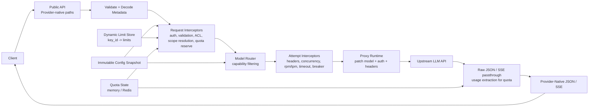

# llmgw

Proxy-first LLM gateway in Go for routing, limits, and quota enforcement.

### API

- `GET /v1/models`
- `GET /v1/limits`
- `PUT /v1/limits`
- `POST /v1/chat/completions`
- `POST /v1/responses`
- `POST /v1/completions`
- `POST /v1/embeddings`
- `POST /v1/messages`
- `POST /v1beta/models/{model}:generateContent`
- `POST /v1beta/models/{model}:embedContent`
- `POST /v1/models/{model}:generateContent`
- `POST /v1/models/{model}:embedContent`
- `GET /openapi.json`
- `GET /openapi.yaml`
- `GET /docs`
- `GET /healthz`
- `GET /readyz`
- `GET /metrics`
- Provider-native request validation with raw upstream proxying
- SSE passthrough for streaming providers
- Model-based routing, capability filtering, fallback, circuit breaking, rpm/tpm/concurrency, quota reservation, rate limiting via `x/time/rate` and `redis_rate`, metrics, and tracer hook points

Ingress is provider-native: existing OpenAI, Anthropic, and Gemini clients can keep their request contracts and only change the base URL.

## Run

Set provider keys:

```bash
export OPENAI_API_KEY=...
export ANTHROPIC_API_KEY=...
export GEMINI_API_KEY=...
```

Gateway auth can use either static bearer tokens from [`config/config.yaml`](/config/config.yaml) or JWTs. For JWT mode, configure `auth.jwt` with an HMAC secret or public key and map the `key_id` claim to the quota subject. Quota enforcement is key-scoped, and `/v1/limits` reads or writes the limits for the authenticated `key_id`.

Start the gateway:

```bash
go run ./cmd/llmgw -config config/config.example.yaml
```

Run with Docker Compose:

```bash
export OPENAI_API_KEY=...
export ANTHROPIC_API_KEY=...
export GEMINI_API_KEY=...
docker compose up --build
```

Build and run the container directly:

```bash
docker build -t llmgw:local .
docker run --rm -p 8080:8080 \
  -e OPENAI_API_KEY \
  -e ANTHROPIC_API_KEY \
  -e GEMINI_API_KEY \
  -v "$PWD/config/config.yaml:/etc/llmgw/config.yaml:ro" \
  llmgw:local
```

## Deploy To Nebius (GitHub Actions)

This repo includes [`.github/workflows/deploy-nebius.yml`](.github/workflows/deploy-nebius.yml).

Required GitHub repository secrets:
- `NB_PROJECT_ID`
- `NB_SUBNET_ID`
- `NB_SERVICE_ACCOUNT_ID`
- `NB_PUBLIC_KEY_ID`
- `NB_PRIVATE_KEY_PEM`

Optional secrets:
- `NB_ENDPOINT_AUTH_TOKEN`
- `NB_REGISTRY_USERNAME`
- `NB_REGISTRY_PASSWORD`
- `OPENAI_API_KEY`
- `ANTHROPIC_API_KEY`
- `GEMINI_API_KEY`
- `LLMGW_JWT_SECRET`
- `LLMGW_POSTGRES_DSN`
- `LLMGW_REDIS_ADDR`
- `LLMGW_REDIS_PASSWORD`
- `LLMGW_BEARER_TOKEN`

Optional repository variables:
- `NB_ENDPOINT_NAME` (default: `llmgw`)
- `NB_PLATFORM` (default: `cpu-d3`)
- `NB_PRESET` (default: `4vcpu-16gb`)
- `NB_CONTAINER_PORT` (default: `8080`)

The workflow builds and pushes a Docker image to GHCR, then recreates the Nebius endpoint with the new image.

Generate the OpenAPI YAML without starting the server:

```bash
go run ./cmd/llmgw -config config/config.example.yaml -print-openapi > openapi.yaml
```

The checked-in [`openapi.yaml`](/openapi.yaml) is a convenience snapshot. The live source of truth is generated from the running config and served at `/openapi.yaml`.

Reload config in place:

```bash
pkill -HUP -f llmgw
```

## Performance benchmark

Run the loopback HTTP benchmark for the main endpoints:

```bash
go test ./test/performance \
  -run '^$' \
  -bench '^BenchmarkHTTP$' \
  -benchmem \
  -benchtime=5s \
  -count=3
```

The benchmark exercises the real HTTP ingress and the production-style in-memory auth, required user/project checks, token validation, key-scoped quota reservation, RPM/TPM, route/provider concurrency, ACL, routing, metrics, response, and settlement path. Limit ceilings are deliberately high enough to execute enforcement without throttling valid benchmark traffic. An in-process provider stub returns a fixed successful response immediately, so the result measures gateway throughput without external provider or network latency. The load generator and gateway share the same Go process and CPU allocation; use `-cpu=1,4,8` to compare scaling. JSON logs are formatted but written to `io.Discard`, keeping terminal or disk speed out of the measurement.

## Curl

List models:

```bash
curl -s http://localhost:8080/v1/models
```

OpenAI chat completions:

```bash
curl -s http://localhost:8080/v1/chat/completions \
  -H 'Authorization: Bearer local-dev-token' \
  -H 'Content-Type: application/json' \
  -d '{
    "model":"gpt-4o-mini",
    "messages":[{"role":"user","content":"Say hello in one sentence."}]
  }'
```

OpenAI chat streaming:

```bash
curl -N http://localhost:8080/v1/chat/completions \
  -H 'Authorization: Bearer local-dev-token' \
  -H 'Content-Type: application/json' \
  -d '{
    "model":"gpt-4o-mini",
    "stream":true,
    "messages":[{"role":"user","content":"Count to 3."}]
  }'
```

OpenAI responses:

```bash
curl -s http://localhost:8080/v1/responses \
  -H 'Authorization: Bearer local-dev-token' \
  -H 'Content-Type: application/json' \
  -d '{
    "model":"gpt-4o-mini",
    "input":"Summarize the purpose of this gateway in one line."
  }'
```

OpenAI legacy completions:

```bash
curl -s http://localhost:8080/v1/completions \
  -H 'Authorization: Bearer local-dev-token' \
  -H 'Content-Type: application/json' \
  -d '{
    "model":"gpt-4o-mini",
    "prompt":"Write one short sentence about Go."
  }'
```

OpenAI embeddings:

```bash
curl -s http://localhost:8080/v1/embeddings \
  -H 'Authorization: Bearer local-dev-token' \
  -H 'Content-Type: application/json' \
  -d '{
    "model":"gpt-4o-mini",
    "input":"gateway"
  }'
```

JWT-backed quota limits:

```bash
export LLMGW_JWT_SECRET=test-secret

TOKEN="$(python3 - <<'PY'
import jwt, time
print(jwt.encode({
  'iss': 'llmgw',
  'aud': 'gateway',
  'sub': 'session-1',
  'key_id': 'partner-key-123',
  'iat': int(time.time()),
  'exp': int(time.time()) + 3600,
}, 'test-secret', algorithm='HS256'))
PY
)"

curl -s http://localhost:8080/v1/limits \
  -H "Authorization: Bearer $TOKEN"

curl -s -X PUT http://localhost:8080/v1/limits \
  -H "Authorization: Bearer $TOKEN" \
  -H 'Content-Type: application/json' \
  -d '{
    "rpm": 120,
    "tpm": 500000,
    "max_parallel": 8,
    "daily_tokens": 2000000
  }'
```

Metrics:

```bash
curl -s http://localhost:8080/metrics
```

OpenAPI YAML:

```bash
curl -s http://localhost:8080/openapi.yaml
```

OpenAPI JSON:

```bash
curl -s http://localhost:8080/openapi.json
```

Interactive docs:

```bash
open http://localhost:8080/docs
```

Provider-native Anthropic request:

```bash
curl -s http://localhost:8080/v1/messages \
  -H 'Authorization: Bearer local-dev-token' \
  -H 'Content-Type: application/json' \
  -d '{
    "model":"claude-3-7-sonnet-latest",
    "messages":[{"role":"user","content":"Say hello in one sentence."}]
  }'
```

Provider-native Gemini request:

```bash
curl -s http://localhost:8080/v1beta/models/gemini-2.5-flash:generateContent \
  -H 'Authorization: Bearer local-dev-token' \
  -H 'Content-Type: application/json' \
  -d '{
    "contents":[{"role":"user","parts":[{"text":"Say hello in one sentence."}]}]
  }'
```

## Architecture Overview

The gateway uses provider-native ingress paths for each family:
- OpenAI: `/v1/chat/completions`, `/v1/responses`, `/v1/completions`, `/v1/embeddings`
- Anthropic: `/v1/messages`
- Gemini: `/v1beta/models/{model}:generateContent`, `/v1beta/models/{model}:embedContent` (also `/v1/models/{model}:...`)

Requests keep their provider wire format and route only to matching providers.

The core still uses [`Request`](/gateway/types.go) for routing, quota, and policy decisions, but upstream execution is now proxy-first: validate the request shape, patch controlled fields like `model`, then forward the raw body to the selected upstream.


```

The request flow is:

1. HTTP request lands on [`server.go`](/api/server.go).
2. The request is validated and decoded into [`Request`](/gateway/types.go) metadata plus the original raw body.
3. Request-scope interceptors run once for auth, request validation, token estimation, ACL checks, scope resolution, and quota reservation.
4. The router resolves the requested model name into candidate routes and filters by capabilities.
5. Attempt-scope interceptors run for each upstream attempt, handling provider headers, route/provider concurrency, rpm/tpm, timeout, retry, and circuit breaking.
6. The proxy runtime patches controlled fields like `model`, applies upstream auth, and forwards the raw request body to the selected provider.
7. The gateway passes provider-native output back to the client and extracts usage for quota settlement when it can.
8. Quota is committed or refunded when the call settles.

This keeps the hot path smaller while still supporting routing, fallbacks, streaming, and provider-specific request families.

The public surface also exposes generated OpenAPI documents at [`/openapi.yaml`](/api/spec.go) and [`/openapi.json`](/api/spec.go), plus Swagger UI at [`/docs`](/api/server.go). The spec is generated from code and the current config snapshot, so model enums and auth requirements stay aligned with the running service.

Config is an immutable snapshot stored behind an atomic pointer. Reload swaps the whole snapshot, so reads stay lock-free on the hot path.

Token validation currently uses effective-request inspection plus local estimation. Unary responses settle quotas from provider usage fields when present; streaming responses use passthrough plus fallback settlement.

## How Limits Work

The gateway has more than one kind of limit because different layers solve different problems.

### 1. Token key quotas

These are the limits attached to the authenticated `key_id`. They are enforced once per logical request and represent what a client token is allowed to consume.

Supported key-scoped quota fields:

- `rpm`
- `tpm`
- `max_parallel`
- `max_spend_micros`
- `daily_tokens`
- `monthly_tokens`
- `max_input_tokens`
- `max_output_tokens`
- `model_allowlist`
- `provider_allowlist`

Static defaults can still come from `quota.profiles` and `quota.keys` in config, but runtime overrides now take precedence and can be managed through `GET /v1/limits` and `PUT /v1/limits` for the authenticated `key_id`.

Quota enforcement is reservation-based:

1. estimate usage
2. reserve quota
3. call upstream
4. commit actual usage or refund unused reservation

### 2. Route and provider guards

These are operational safeguards, not client entitlement policy. They protect the gateway and upstream providers on each attempt.

Supported route guard fields:

- `rpm`
- `tpm`
- `concurrency`
- `provider_concurrency`
- `max_body_bytes`

In-memory mode uses local `golang.org/x/time/rate` plus in-process concurrency/breaker state. Redis mode adds shared cross-instance controls for route/provider concurrency and circuit-breaker state, and applies quota reservations atomically in Redis.

### 3. Capability caps

Capabilities describe what a route can actually do. They are used during routing and validation, not for spend accounting.

Currently enforced in the hot path:

- supported operations
- streaming
- route `max_output_tokens`

Other capability fields are still present in config and documentation, but they are not currently used as hard routing gates in the proxy-first runtime.

### 4. Request-level auth guards

These are simple request-shape requirements:

- `auth.max_body_bytes`
- `auth.require_user`
- `auth.require_project`

Short version:

- use key quotas to control client consumption
- use route/provider guards to protect infrastructure
- use capabilities to keep routing correct

## Tests

Run:

```bash
go test ./...
```

Hot-path benchmark:

```bash
go test -bench=. ./test/unit/gateway
```

## Tracing

The observer keeps a small tracer hook interface in [`observer.go`](/observer/observer.go). By default it is a no-op tracer. If you want full OpenTelemetry integration, inject an adapter that satisfies `observer.Tracer` and forwards spans into your OTel SDK setup.

## Add A Provider

1. Extend request validation and metadata decoding in [`providers`](/proxy/providers).
2. Add proxy path, auth-header, and usage-extraction rules in [`proxy.go`](/proxy/proxy.go).
3. Keep the gateway core on `gateway.Request`, route resolution, and quota settlement. Do not add a new SDK-heavy adapter tree unless proxying cannot express the provider family.
4. Register the provider in [`main.go`](/cmd/llmgw/main.go) and add route entries in config.
