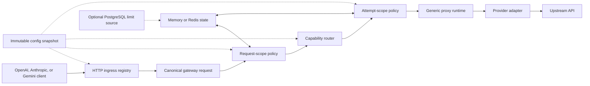

llmgw is a single Go binary with two logical planes:

- The **data plane** authenticates inference requests, applies policy, chooses a route, calls an upstream provider, and settles usage.
- The **configuration and operations plane** loads immutable configuration, exposes health and metrics, and optionally refreshes quota limits from PostgreSQL.

The hot path does not query PostgreSQL. It uses the current in-memory configuration snapshot plus memory or Redis-backed admission state.

## Protocol boundaries

The service deliberately has three different extension boundaries:

1. An [`api.Ingress`](https://github.com/egor-baranov/llmgw/blob/main/api/ingress.go) owns a northbound HTTP protocol: paths, authentication headers, request decoding, and error envelopes.
2. The [`gateway.Engine`](https://github.com/egor-baranov/llmgw/blob/main/gateway/gateway.go) owns provider-neutral execution: canonical metadata, request and attempt interceptors, capability routing, fallback, and settlement.
3. A [`proxy.Adapter`](https://github.com/egor-baranov/llmgw/blob/main/proxy/adapter.go) owns a southbound provider protocol: URLs, authentication, headers, request preparation, response validation, error parsing, usage extraction, and stream semantics.

This separation keeps provider names out of central routing and policy switches. One compile-time binding list in [`api/ingress.go`](https://github.com/egor-baranov/llmgw/blob/main/api/ingress.go) derives both the built-in ingress and provider registries consumed by [`app.New`](https://github.com/egor-baranov/llmgw/blob/main/app/app.go). The resulting providers are checked against every configured route at startup and reload.

## Canonical request and result

Ingress decoders preserve the provider-native JSON body while extracting normalized fields into [`gateway.Request`](https://github.com/egor-baranov/llmgw/blob/main/gateway/types.go):

- public model alias and canonical operation;
- stream flag;
- request identity, user, project, headers, and body size;
- capability hints such as tools, structured output, vision, audio, and reasoning;
- token-estimation hints and requested output limits.

The raw JSON is intentional: llmgw can proxy provider features without reducing every vendor schema to a lossy shared payload. Policy reads normalized hints; the selected adapter reads and patches the original body.

The result follows the same rule. [`gateway.Result`](https://github.com/egor-baranov/llmgw/blob/main/gateway/types.go) contains normalized provider, route, model, status, and usage metadata plus either a raw unary body or a streaming reader.

## Package responsibilities

| Package | Responsibility |
| --- | --- |
| [`api`](https://github.com/egor-baranov/llmgw/tree/main/api) | HTTP routes, provider-native ingress, operational endpoints, response streaming, and error envelopes |
| [`app`](https://github.com/egor-baranov/llmgw/tree/main/app) | Dependency assembly, provider registry, stores, listener lifecycle, reload, and shutdown |
| [`gateway`](https://github.com/egor-baranov/llmgw/tree/main/gateway) | Core request/result types, immutable configuration, router, interceptor contracts, fallback, and usage accumulation |
| [`policy`](https://github.com/egor-baranov/llmgw/tree/main/policy) | Authentication, request validation, ACLs, token estimation, quota, rate limits, concurrency, retries, and circuit breaking |
| [`proxy`](https://github.com/egor-baranov/llmgw/tree/main/proxy) | Generic HTTP transport plus compile-time provider adapters and compatibility bridges |
| [`store`](https://github.com/egor-baranov/llmgw/tree/main/store) | Memory and Redis admission state; optional PostgreSQL-backed quota-limit snapshots |
| [`observer`](https://github.com/egor-baranov/llmgw/tree/main/observer) | JSON logs, Prometheus-format metrics, and a small tracing hook |
| [`cmd/llmgw`](https://github.com/egor-baranov/llmgw/tree/main/cmd/llmgw) | CLI flags and signal handling |

## Immutable configuration

Configuration is parsed with unknown YAML fields rejected, environment references resolved, defaults applied, and routes validated before use. [`gateway.ConfigStore`](https://github.com/egor-baranov/llmgw/blob/main/gateway/config.go) holds an atomic pointer to the active snapshot.

Each request loads one snapshot at ingress and passes that exact snapshot through decoding, policy, routing, and dispatch. A successful reload atomically replaces the pointer for new requests; in-flight requests continue with the snapshot they started with. See [Reliability and reload](/operations/reliability).

## State choices

- **Memory mode** is dependency-free and useful for local development or a single process. Rate, quota, concurrency, and breaker state are process-local and disappear on restart.
- **Redis mode** shares those controls across replicas. The implementation uses atomic Lua operations and requires a writable standalone Redis primary with the command set verified at startup.
- **PostgreSQL is optional** and stores dynamic quota-limit definitions. The data plane reads an atomically refreshed in-memory snapshot rather than querying SQL per request.

Continue with [Request lifecycle](/concepts/request-lifecycle) for the exact execution order and [Provider registry](/concepts/provider-registry) for extension points.
