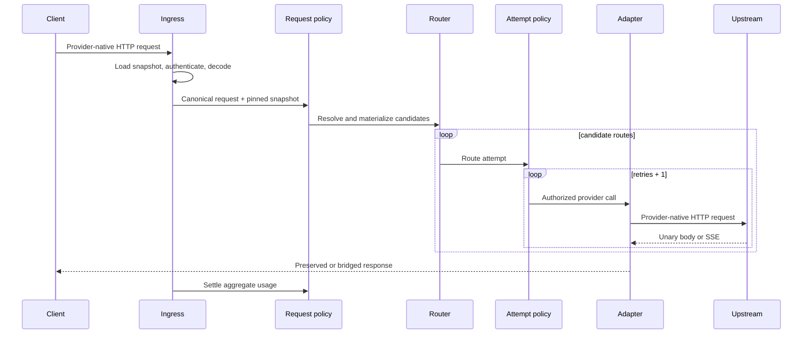

llmgw has two interceptor rings with different lifetimes:

- **Request-scope interceptors** run once for a client request, regardless of retries or fallback routes.
- **Attempt-scope interceptors** run for each candidate route and each real upstream retry.

This avoids repeating authentication and quota-scope decisions while still enforcing route-local limits on every upstream call.

## 1. Ingress

The matched ingress performs these steps in [`api.Server.handleIngressOperation`](https://github.com/egor-baranov/llmgw/blob/main/api/server.go):

1. Load the current configuration snapshot.
2. Authenticate before reading the request body.
3. Decode and validate the provider-native request within `auth.max_body_bytes`.
4. Set the canonical provider and operation from the ingress, not from untrusted JSON.
5. Attach or generate `X-Request-ID` and call the engine with the already-loaded snapshot.

Provider-native credential headers are accepted by their ingress: Anthropic can use `x-api-key`, Gemini can use `x-goog-api-key`, and all built-in ingresses accept bearer authorization. The authenticated principal is put into the request context for the policy ring.

## 2. Request-scope ring

[`app.New`](https://github.com/egor-baranov/llmgw/blob/main/app/app.go) assembles the request interceptors in this outer-to-inner order:

| Order | Interceptor | Purpose |
| --- | --- | --- |
| 1 | `observer.RequestMetrics` | Starts request logs, metrics, and the tracing hook; finishes after settlement or stream completion |
| 2 | `policy.Auth` | Uses the ingress-authenticated principal and rejects missing authentication when required |
| 3 | `policy.MetadataValidation` | Validates normalized metadata and identity fields |
| 4 | `policy.RequireUser` | Enforces `auth.require_user` |
| 5 | `policy.RequestSize` | Filters candidates by route request-size limits after ingress has enforced the global body cap |
| 6 | `policy.TokenValidation` | Estimates candidate-specific usage and effective output limits using tokenizer and adapter hooks |
| 7 | `policy.ACL` | Applies the authenticated principal's model, provider, and project ACLs |
| 8 | `gateway.CandidatePreflight` | Removes deterministic adapter incompatibilities before quota is consumed |
| 9 | `policy.ResolveScopes` | Resolves static/dynamic key limits and applies their model, provider, token, and bounded provider-unit rules |
| 10 | `policy.Quota` | Creates an idempotent request reservation, tops it up for real calls, renews it, then commits or refunds |

Candidate resolution is lazy, but after it happens the candidates are stored in the request state. Token estimates, effective output tokens, and estimated spend may differ by route.

## 3. Routing

The router matches the public model alias and ingress provider, filters routes by operation and capability, asks the provider for a bridge only when native operation support is absent, and orders the survivors. See [Routing and streaming](/concepts/routing-and-streaming).

The request carries its ingress provider. Therefore a native OpenAI request selects `openai` routes, an Anthropic request selects `anthropic` routes, and a Gemini request selects `gemini` routes. Fallback happens between compatible routes for that protocol; llmgw does not implicitly translate an Anthropic body into Gemini or OpenAI.

## 4. Attempt-scope ring

For every candidate, the engine builds an attempt and invokes this ring:

1. [`policy.AttemptLimits`](https://github.com/egor-baranov/llmgw/blob/main/policy/attempt.go) checks the circuit, acquires route and provider concurrency, authorizes quota for the real call, atomically debits route RPM/TPM, applies the route timeout, and performs up to `retries + 1` calls.
2. `policy.AttemptHeaders` adds gateway request, attempt, retry, provider, route, model, and safe user/project headers to the resolved route.
3. `observer.AttemptMetrics` records one attempt span, metric, and log for each actual upstream call. For streams it remains open through EOF or close.
4. The selected [`gateway.Provider`](https://github.com/egor-baranov/llmgw/blob/main/gateway/gateway.go) invokes the adapter-backed proxy runtime.

Concurrency is held for the full route attempt, including its retries. For streaming results it remains held until the stream completes, fails, times out, or is closed.

## 5. Provider call and result validation

The generic proxy runtime in [`proxy.Provider.Invoke`](https://github.com/egor-baranov/llmgw/blob/main/proxy/proxy.go):

- lets the operation adapter prepare the URL and body;
- applies gateway, route, forwarded, and provider-auth headers;
- refuses redirects so credentials cannot be replayed to another host;
- enforces bounded upstream bodies;
- parses provider errors and usage;
- validates successful unary response shapes;
- validates SSE content type and tracks usage and terminal events for streams;
- applies a compatibility response transform when the adapter planned one.

The engine rejects empty, unsuccessful, or malformed provider results. It prefetches the first stream bytes before accepting a streaming result, which makes pre-stream failures eligible for another candidate and prevents a late fallback after response delivery has begun.

## 6. Response and settlement

Unary bytes are written with preserved safe upstream headers. SSE bytes are flushed as they arrive and the downstream write-idle deadline is refreshed for every chunk. The gateway exposes its own `X-Request-ID`; an upstream `X-Request-ID` is renamed to `X-LLMGW-Upstream-Request-ID`.

After the body completes or fails, the API calls [`Execution.Settle`](https://github.com/egor-baranov/llmgw/blob/main/gateway/gateway.go) on a detached five-second context. Settlement aggregates de-duplicated usage from every billable retry and fallback, then commits actual tokens and spend or refunds the reservation. A stream that has begun can still be charged from provider-reported partial or final usage even if the downstream client disconnects.
