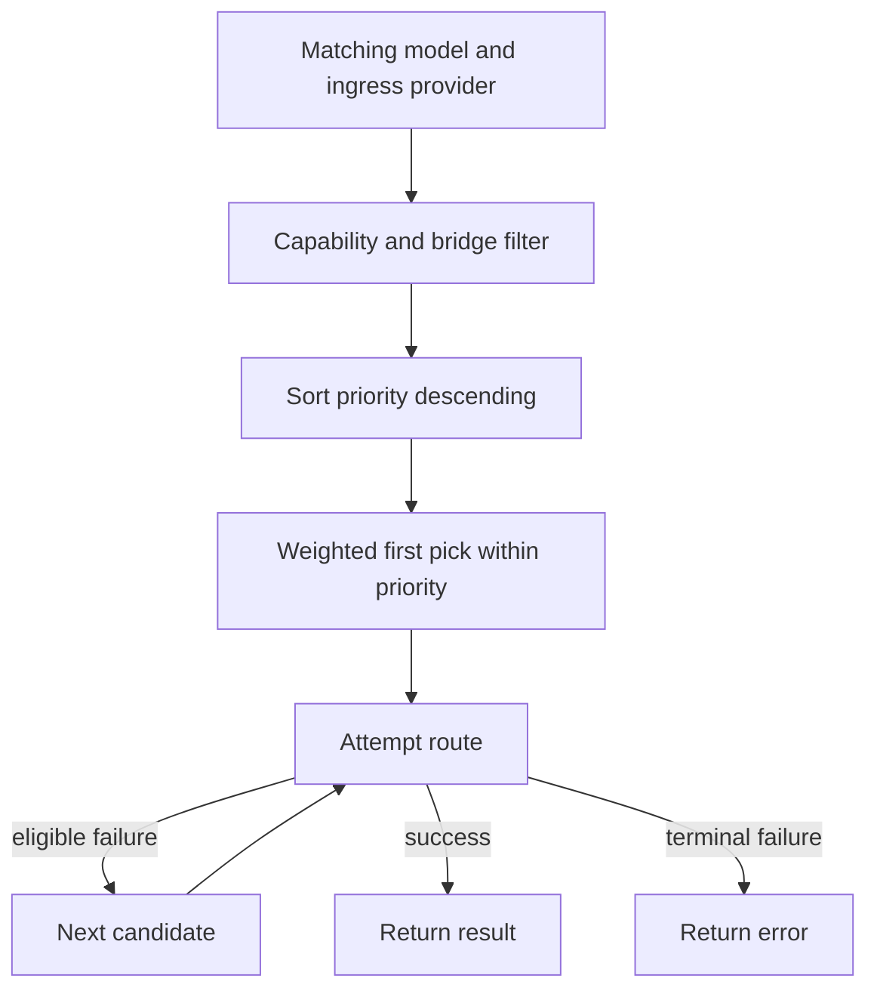
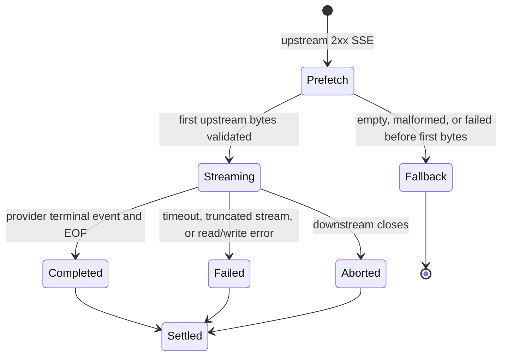

Routes with the same public `model` form a route group. The router uses configuration and normalized request hints to decide which routes can safely serve a request before any upstream call begins.

## Candidate filtering

[`Router.Resolve`](https://github.com/egor-baranov/llmgw/blob/main/gateway/gateway.go) first considers routes whose:

- `model` matches the requested public alias;
- `provider` matches the northbound ingress protocol;
- declared operations include the requested operation, or whose provider adapter supplies an eligible compatibility bridge;
- capabilities cover streaming, tools, structured output, vision, audio, reasoning, and the requested maximum output tokens.

Adapter preflight runs after token estimation and ACL checks but before quota reservation. It catches body-specific bridge failures that a capability flag alone cannot represent.

If no route has the model, the API returns `model_not_found`. If the model exists but every route lacks a required capability, it returns `unsupported_operation` with route-local reasons.

## Priority and weight

Candidates are ordered in two levels:

1. Higher `priority` values are attempted before lower values.
2. Within one priority, `weight` selects the first candidate using a deterministic hash of the internal execution ID. The list then wraps around from that candidate for fallback.

Clients cannot steer the weighted choice with `X-Request-ID`: engine execution IDs are generated privately. A direct router-only caller without an execution ID falls back to the public request ID.

## Retry versus fallback

The two mechanisms operate at different levels:

- `retries` repeats the same route inside `AttemptLimits`, subject to the adapter error's retry disposition and the route timeout on each call.
- fallback advances to the next resolved route only when the final error is marked or classified as fallback-eligible.

Timeouts and provider/server failures are generally eligible. Client cancellation is terminal. Provider authentication failures are not retried, but they may allow a healthy fallback route. Ordinary rejected 4xx calls with no reported usage are marked unbillable; provider-reported usage from failed calls is accumulated and settled.

Every real retry consumes route RPM/TPM and emits attempt telemetry. The quota ticket is idempotent and tracks all billable attempts so retries are not hidden from spend accounting.

## Circuit breaking

Each route has a circuit identity derived from its name and upstream identity. After `circuit.failures` qualifying failures, the route is held open for `circuit.cooldown`. Stale successes from calls admitted before a newer failure cannot close the circuit.

In memory mode, breakers are process-local. In Redis mode, circuit state and timestamps are shared across replicas and use the Redis clock. Circuit, concurrency, or rate admission can fail a candidate without calling the upstream.

## Compatibility bridges

Bridges are planned by the provider adapter through `ProviderBridgePlanner`; the gateway core does not contain a provider switch.

The built-in OpenAI adapter can use a route that advertises `chat.completions` to serve:

- a non-streaming Responses request whose fields can be represented by Chat Completions;
- a legacy Completions request with a representable string prompt.

Unsupported fields fail preflight and can fall back to a route with native operation support. Streaming Responses-to-Chat is deliberately unsupported. Streaming legacy Completions can be bridged: request chunks remain provider Chat Completions internally and are converted to the legacy chunk shape on the way out.

No bridge converts between provider protocols. An OpenAI-compatible third-party endpoint should be configured as an `openai` route with its own `base_url` and `upstream_model`.

## Streaming lifecycle

llmgw expects provider streams to use `text/event-stream`. The adapter supplies provider-specific terminal-event and usage extraction functions while the runtime preserves raw SSE bytes by default.

Important consequences:

- Candidate fallback stops once the stream passes validation and its first upstream bytes are prefetched. There is no midstream fallback.
- EOF without the adapter's terminal event becomes `truncated_stream` and counts as a provider failure.
- Usage tracking buffers at most one bounded SSE event and exposes the latest usage snapshot during settlement.
- Route concurrency and timeout ownership continue for the stream lifetime.
- `server.stream_write_timeout` is a downstream write-idle deadline, refreshed for each chunk; it is not a total stream duration.
- `limits.max_response_bytes` caps source bytes. If an adapter transforms the representation, the transformed output is capped again and stale integrity/length headers are removed.

See [Reliability](/operations/reliability) for timeout and failure-boundary guidance.
