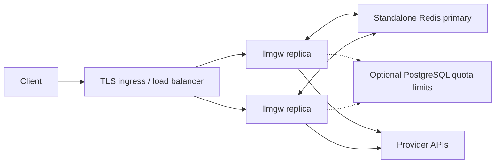

llmgw is distributed as one Go service binary with one HTTP listener. The checked-in container builds it statically with CGO disabled. It does not terminate TLS itself; production deployments should place it behind a trusted TLS-terminating load balancer or ingress and restrict direct access to the listener.

## Build the binary

The module requires Go 1.24 or newer and declares Go 1.24.13 as its default compatibility toolchain. CI also tests Go 1.26.5, which is used by the production image build.

```bash
go build -trimpath -o ./bin/llmgw ./cmd/llmgw

LLMGW_BEARER_TOKEN='replace-me' \
OPENAI_API_KEY='replace-me' \
ANTHROPIC_API_KEY='replace-me' \
GEMINI_API_KEY='replace-me' \
./bin/llmgw -config ./config/config.example.yaml
```

Use only the provider environment variables referenced by your actual routes. Generate the OpenAPI document without starting a listener with:

```bash
tmp="$(mktemp ./.openapi.yaml.XXXXXX)"
trap 'rm -f "$tmp"' EXIT
LLMGW_BEARER_TOKEN=openapi-placeholder \
OPENAI_API_KEY=openapi-placeholder \
ANTHROPIC_API_KEY=openapi-placeholder \
GEMINI_API_KEY=openapi-placeholder \
  ./bin/llmgw -config ./config/config.example.yaml -print-openapi > "$tmp"
mv "$tmp" openapi.yaml
trap - EXIT
```

Writing a temporary file first preserves the previous snapshot if validation or generation fails.

## Run the checked-in container

The multi-stage [`Dockerfile`](https://github.com/egor-baranov/llmgw/blob/main/Dockerfile) builds a CGO-disabled binary and runs it as the unprivileged `llmgw` user on Alpine. The checked-in [`compose.yaml`](https://github.com/egor-baranov/llmgw/blob/main/compose.yaml) mounts the example configuration read-only and probes `/readyz`.

```bash
export LLMGW_BEARER_TOKEN='replace-me'
export OPENAI_API_KEY='replace-me'
export ANTHROPIC_API_KEY='replace-me'
export GEMINI_API_KEY='replace-me'
docker compose up --build
```

The Compose service publishes port `8080` and uses `restart: unless-stopped`. It is a local example; it uses the memory store unless you change the mounted configuration.

## Production topology



Use `store.mode: redis` for more than one replica. Memory mode gives each process independent RPM, TPM, quota, concurrency, and circuit state and loses it on restart.

The Redis implementation currently targets a standalone primary, not Redis Cluster. Prefer an environment-backed `rediss://` URL, choose a namespace unique to the deployment, and allow the command/script set verified by `ValidateStartup`. The service fails startup if the dependency cannot enforce the configured controls.

PostgreSQL is optional. It is the durable source for dynamic per-key quota limits; request-path reads use a local immutable snapshot. Redis still owns shared quota usage and admission when Redis mode is enabled.

## Secrets and configuration

Keep these values in a secret manager and inject them as environment variables referenced by YAML:

- gateway bearer tokens and JWT secrets/private verification material;
- provider API keys;
- Redis URL or password;
- PostgreSQL DSN.

The loader fails when a referenced environment variable is missing or empty. Literal secret fields exist for development but make configuration files and container layers harder to secure.

Mount the configuration read-only. To apply a supported route/auth/quota change, atomically replace the mounted file and send `SIGHUP`. Restart for server, store, or telemetry changes. See [Reliability and reload](/operations/reliability).

## Probes and lifecycle

Recommended orchestrator probes:

```yaml
livenessProbe:
  httpGet:
    path: /healthz
    port: 8080
readinessProbe:
  httpGet:
    path: /readyz
    port: 8080
```

Use a startup allowance longer than `store.startup_timeout` plus image scheduling time. When PostgreSQL is configured, budget conservatively for two sequential timeout windows: one for PostgreSQL initialization and another for startup health/capability checks. Set the pod or service termination grace period longer than `server.shutdown_timeout` so active unary requests and streams can drain.

During a rolling deployment, readiness should remove a terminating replica before its grace period. Redis-backed reservations and leases expire if a process dies without releasing them; normal shutdown releases them promptly.

## Network policy

Allow outbound traffic only to:

- configured provider `base_url` hosts;
- Redis when enabled;
- PostgreSQL when enabled;
- infrastructure DNS and certificate services required by the environment.

Allow inbound traffic from the trusted load balancer and monitoring system. `/metrics` requires a bearer principal with `view_operations` unless anonymous mode is explicitly enabled, so configure the scraper with that credential.

## Capacity and timeout starting points

Tune each route independently:

- `limits.concurrency` bounds work for one route;
- `limits.provider_concurrency` is shared by provider name and must be consistent across that provider's routes;
- `limits.rpm` and `limits.tpm` are charged for every real retry;
- `timeout` must cover the entire upstream call or stream;
- `limits.max_response_bytes` protects memory and bandwidth;
- `server.stream_write_timeout` should exceed expected gaps between streamed chunks.

Watch request latency, inflight requests, attempt amplification, route error rates, quota denial reasons, and stale quota snapshots while tuning. See [Observability](/operations/observability).
